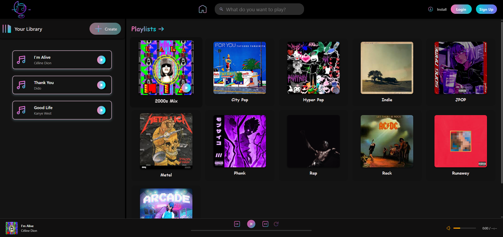

# Rym Music Player 🎵

A dynamic web music player with **automatic playlist generation** and a clean, modern UI.

 *<!-- Add screenshot later -->*

## Features ✨

- 🎧 Play/pause, previous/next track controls
- 📁 **100% Dynamic playlist generation** - automatically creates playlists from song folders
- 🖼️ **Smart thumbnail system** - uses any image in song folders as playlist covers
- 🔄 **Auto-update system** - detects new folders and songs automatically
- 🔍 Search functionality (UI ready)
- 📶 Volume control with mute toggle
- 🎼 Real-time progress bar with seek functionality
- 📱 Responsive design (mobile-friendly)
- 🖥️ Modern UI with light/dark theme support
- 🌐 GitHub API integration for hosted deployment
- 💾 Smart caching for better performance

## Technologies Used 🛠️

- **Frontend**: HTML5, CSS3, JavaScript (ES6+)
- **Audio**: Web Audio API
- **API**: GitHub Contents API for dynamic playlist loading
- **Icons**: Custom SVG icons
- **Config**: JSON-based dynamic configuration
- **Tools**: Node.js for playlist generation
- **Hosting**: GitHub Pages compatible

## 🚀 Quick Start

### Simple Setup (Recommended)
1. Add your music folders to `songs/` directory
2. **Navigate to project folder** in VS Code terminal:
   ```cmd
   cd "path/to/your/music-player"
   ```
3. **Generate playlists**:
   ```cmd
   node generate-playlists.js
   ```
4. **Start a local server** (see below) or use Live Server extension
5. Open your browser to the server URL
6. Enjoy your music! 🎵

### 🌐 Running the Music Player

#### Option 1: VS Code Live Server (Easiest)
1. Install "Live Server" extension in VS Code
2. Right-click on `index.html` → "Open with Live Server"
3. ✅ Done! Opens automatically with correct URL

#### Option 2: Python HTTP Server
```cmd
python -m http.server 8000
```
Then open: `http://localhost:8000`

#### Option 3: Node.js HTTP Server
```cmd
npx http-server
```
Then open the provided URL

⚠️ **Important**: Don't open `index.html` directly (file://) - use a local server to avoid CORS issues!

### Auto-Update Mode
1. Run `node generate-playlists.js --watch` for automatic updates
2. Add new folders anytime - they'll appear instantly!

## 🆕 Dynamic Playlist System

### How It Works
The music player **automatically** creates playlists based on folders in the `songs/` directory:

- **Each folder** = One playlist (must contain MP3 files)
- **Folder name** = Playlist title
- **Any image in folder** = Playlist thumbnail (optional)
- **All MP3 files** = Playlist songs
- **Auto-detection** = No manual coding required!

⚠️ **Important**: Only folders containing `.mp3` files will be recognized as playlists!

### Adding New Playlists

#### Method 1: Simple (Most Users)
1. **Create a folder** in the `songs/` directory:
   ```
   songs/Your New Playlist/
   ```

2. **Add your music files** (MP3 format) - **REQUIRED**:
   ```
   songs/Your New Playlist/
   ├── Artist - Song 1.mp3
   ├── Artist - Song 2.mp3
   └── Artist - Song 3.mp3
   ```
   ⚠️ **Important**: Folders must contain at least one MP3 file to be recognized as playlists!

3. **Add a thumbnail image** (optional, any name, any supported format):
   ```
   songs/Your New Playlist/
   ├── cover.jpg          ← Playlist thumbnail (optional)
   ├── Artist - Song 1.mp3
   ├── Artist - Song 2.mp3
   └── Artist - Song 3.mp3
   ```
   **Supported thumbnail formats**: `.jpg`, `.jpeg`, `.png`, `.webp`, `.gif`, `.bmp`, `.svg`

4. **Update playlists**: Navigate to project folder and run:
   ```cmd
   cd "path/to/your/music-player"
   node generate-playlists.js
   ```

5. **Refresh the page** - Your playlist appears automatically! 🎉

#### Method 2: Auto-Update Mode (Advanced)
1. Run `node generate-playlists.js --watch` once
2. Add folders anytime - they appear instantly!
3. No manual updates needed 🔄

## 🔧 Setup Requirements

### Prerequisites
- **Node.js** (for playlist generation) - [Download here](https://nodejs.org/)
- **Modern web browser** (Chrome, Firefox, Safari, Edge)
- **MP3 files** for your music

### First Time Setup
1. Install Node.js if you haven't already
2. Place this music player in a folder
3. **Open terminal/command prompt and navigate to the music player folder**:
   ```cmd
   cd "path/to/your/music-player"
   ```
4. Add your music to `songs/` directory
5. Run update command (see options below)
6. Open `index.html` in your browser

## 💻 Update Commands

⚠️ **IMPORTANT**: Always navigate to the music player folder first to avoid errors!

```cmd
cd "path/to/your/music-player"
```

### One Simple Command (Works Everywhere!)
The `node` command works in **any terminal**:
- ✅ **Windows CMD** (`cmd.exe`)
- ✅ **PowerShell** 
- ✅ **VS Code Terminal**
- ✅ **Git Bash**
- ✅ **Mac/Linux Terminal**

```cmd
cd "path/to/your/music-player"
node generate-playlists.js
```

### Watch Mode (Auto-Updates)
```cmd
cd "path/to/your/music-player"
node generate-playlists.js --watch
```

**💡 Only Node.js is required!** No additional files needed.

### 📋 **Requirements**
- ✅ **MP3 files**: At least one `.mp3` file is required for folder recognition
- ✅ **Thumbnail**: Any image file (`.jpg`, `.jpeg`, `.png`, `.webp`, `.gif`, `.bmp`, `.svg`) - optional but recommended
- ✅ **Folder name**: Will become the playlist name (spaces allowed)
- ✅ **Node.js**: Required for automatic playlist generation

### ❌ **Common Issues**
- **"Node.js not found"**: Install Node.js from https://nodejs.org/
- **"Cannot find file"**: Make sure you're in the music player directory (`cd "path/to/your/music-player"`)
- **Empty folders**: Won't appear as playlists (need MP3 files)
- **Non-MP3 audio**: Only `.mp3` format is currently supported
- **Missing thumbnail**: Will use default placeholder image
- **Playlists not updating**: Run `node generate-playlists.js` after adding new folders

### Supported Image Formats
- `.jpg` / `.jpeg` (recommended)
- `.png` 
- `.webp`
- `.gif`
- `.bmp`
- `.svg`

### Example Structure
```
songs/
├── City Pop/
│   ├── thumbnail.jpg
│   ├── Tatsuro Yamashita-Christmas Eve.mp3
│   └── Tatsuro Yamashita-Ride on Time.mp3
├── Jazz Collection/
│   ├── cover.png
│   ├── Miles Davis-Kind of Blue.mp3
│   └── John Coltrane-Giant Steps.mp3
└── Electronic/
    ├── artwork.webp
    └── Daft Punk-One More Time.mp3
```

## Project Structure 📂

```
music-player/
├── index.html              # Main HTML file
├── script.js               # Player logic with dynamic playlist system
├── playlists.json          # Auto-generated playlist configuration
├── generate-playlists.js   # Playlist generator script (Node.js)
├── nav.css                 # Navigation bar styles
├── sidebar.css             # Playlist sidebar styles
├── main.css                # Main content styles
├── control.css             # Player controls styles
├── default.jpg             # Default playlist thumbnail
├── .gitignore              # Git ignore file
├── screenshot.png          # Project screenshot
├── svg/                    # SVG icons
│   ├── play.svg
│   ├── pause.svg
│   ├── next.svg
│   └── ...
├── songs/                  # Music folders (playlists)
│   ├── City Pop/
│   │   ├── thumbnail.jpg   # Playlist cover
│   │   └── *.mp3          # Music files
│   ├── Rap/
│   │   ├── thumbnail.jpg
│   │   └── *.mp3
│   └── [More Playlists]/
└── README.md               # This file
```

## Setup & Installation ⚙️

1. **Clone the repository**:
   ```bash
   git clone https://github.com/Flare3416/music-player.git
   cd music-player
   ```

2. **Add your music**:
   - Create folders in the `songs/` directory
   - Add MP3 files and cover images to each folder
   - Follow the structure shown above

3. **Run locally**:
   - Open `index.html` in a web browser
   - Or use a local server for better CORS handling

4. **Deploy to GitHub Pages**:
   - Push to your GitHub repository
   - Enable GitHub Pages in repository settings
   - The player will automatically use GitHub API for playlist loading

## Features in Detail 🔍

### Smart Loading System
- **Production**: Uses GitHub Contents API to fetch playlists
- **Development**: Falls back to predefined playlists for local testing
- **Caching**: Stores playlist data in localStorage for faster loading

### Error Handling
- Graceful fallbacks when images fail to load
- Continues loading other playlists if one fails
- Default placeholder for missing thumbnails

### Audio Controls
- Smooth play/pause transitions
- Previous/next track with playlist wrap-around
- Click-to-seek progress bar
- Exponential volume curve for natural audio control
- Mute/unmute with volume memory

## Browser Compatibility 🌐

- ✅ Chrome 60+
- ✅ Firefox 55+
- ✅ Safari 11+
- ✅ Edge 79+

## Contributing 🤝

1. Fork the repository
2. Create a feature branch
3. Add your music playlists or code improvements
4. Submit a pull request

## License 📄

This project is open source and available under the [MIT License](LICENSE).

## Acknowledgments 🙏

- Icons and UI inspiration from modern music players
- GitHub API for seamless playlist management
- Web Audio API for smooth playback experience
